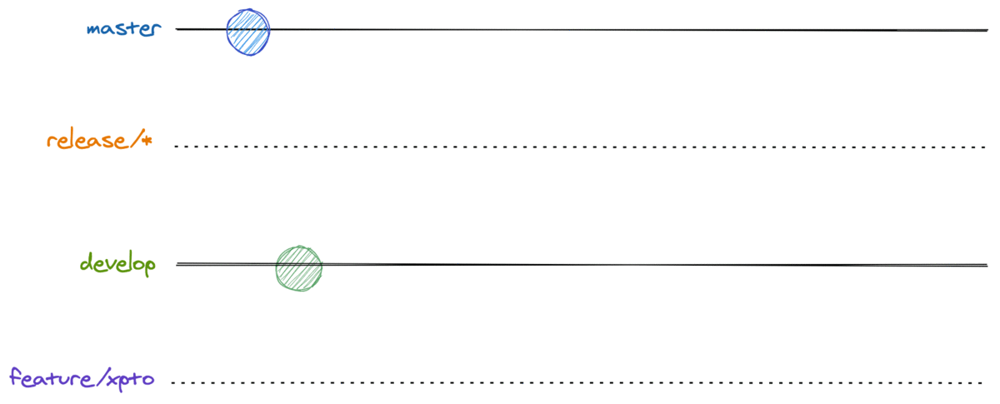

# MokletDev: Gitflow Backend

Gitflow back-end utama sangat mudah diikuti, tetapi mencakup beberapa variasi yang mungkin terjadi pada pekerjaan kita sehari-hari dan juga dijelaskan di sini.

## Gitflow



Alur utama mudah untuk diikuti. Tetapi, pertama-tama, kamu harus memasangkan branch `develop` local kamu dengan apa yang ada di remote upstream.

```bash
git checkout develop
git pull upstream develop
```

Kemudian, saatnya membuat branch feature kamu:

```bash
git checkout -b feature-xpto # atau git branch feature-xpto && git checkout feature-xpto
```

Jika local branch kamu tidak memiliki branch `feature-xpto`, perintah di atas akan membuatnya dan mengalihkan workspace kamu ke branch yang baru dibuat!

Sekarang, saatnya ngoding! Setelah kamu selesai dan merasa telah cukup menuliskan kode untuk di-commit, lanjutkan langkah selanjutnya yaitu untuk memastikan fitur yang kamu tambahkan tidak bertabrakan dengan branch di remote repository

```bash
git pull upstream develop
```

Jika sudah dan hasilnya tidak ada tabrakan/merge conflict, kamu bisa langsung menambah 'changes' dan meng-commit fitur kamu!

```bash
git add file-terubah # jika ingin menambah semua perubahan: git add -A
git commit -m "pesan commit" -m "Tambahan deskripsi" \
           -m "Bisa berapa paragraf yaa?" -m "Homm gatau wkwk" # atau `git commit` untuk memakai git editor kamu (biasanya `vim`)
```

Setelah langkah diatas selesai, jangan lupa untuk merge branch feature kamu ke branch develop di local kamu!

```bash
git checkout develop & git merge feature-xpto --no-ff
```

Jika sudah, langsung lakukan push ke develop origin kamu!

```bash
git push origin develop
```

Setelah banyak `git add` lalu `git commit` dan `git push`, saatnya membawa fitur baru kamu ke branch `develop` upstream dan memperbarui development environment dengan perubahan kamu. Namun sebelum itu, kami dari tim Maintainer/Admin ingin mengevaluasi apa yang kamu lakukan, memeriksa apakah perubahan tersebut sesuai dengan apa yang diminta/diperlukan, apakah ada test (unit/integration) yang cukup, apakah kode tersebut terdapat bug, dll. Dan, untuk ini, kami menjalankan proses disebut melalui **Code Review**. Ini adalah langkah penting untuk mencegah perubahan yang tidak diinginkan dan untuk meningkatkan pengetahuan di seluruh tim.

Jadi, sekarang, kamu perlu membuat merge request atau Pull Request (PR)! Untuk itu, gunakan alat apa pun yang kamu inginkan! kamu bisa pakai GitHub UI ([panduan langkah](https://docs.github.com/en/free-pro-team@latest/github/collaborating-with-issues-and-pull-requests/creating-a-pull-request)) atau GitHub CLI ([manual](https://cli.github.com/manual/gh_pr)). Setelah pembuatannya, panggil Maintainer lain untuk review perubahan kamu. Setelah beberapa diskusi, kemungkinan perubahan di kode, dan hanya setelah kamu dan Maintainer setuju bahwa fitur tersebut dapat berjalan, Maintainer akan merge branch kamu ke `develop`!

Jika semuanya lancar di development environment, kamu bisa hapus branch feature tadi dan membuat cabang rilis baru!

```bash
git push -d origin feature-xpto # delete the feature branch from origin (remote)
git checkout develop && git pull
git checkout -b release/xpto
git push -u origin release/xpto
```


Dan itulah untuk gitflow backend pada MokletDev! :tada: :tada: :tada:

<a name="main-gitflow-tldr"></a>

### Kesimpulan

1. `git checkout develop && git pull upstream develop`
2. `git checkout -b feature-xpto && git push -u origin feature-xpto`
3. Jalankan `git add && git commit -m "pesan commit"`, dan `git push`, sampai fitur selesai.
4. Membuat Pull Request (PR) ke branch `develop` upstream dan panggil Maintainer untuk direview
5. Lakukan perubahan jika diminta, sampai approval
6. Maintainer akan merge fitur ke `develop`, dan kamu bisa hapus branch feature-xpto di local
7. Sekarang, saatnya untuk mengawasi apakah semuanya baik-baik saja dengan fitur kamu di develop/staging/production dan membuat changelog sehingga semua orang tahu apa yang kamu lakukan!
